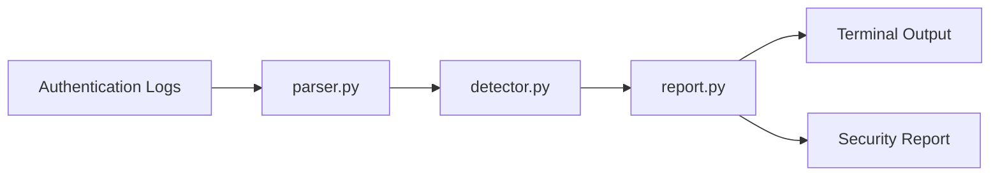
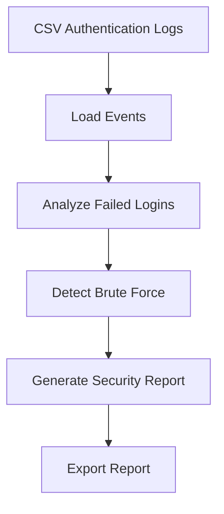

<div align="center">

#  Python SOC Log Analyzer

### Detect • Analyze • Investigate • Report

*A modular Security Operations Center (SOC) log analyzer built with Python.*


---

**Python • Cybersecurity • Threat Detection • Security Automation • GitHub Actions**

</div>

---

# Overview

The **Python SOC Log Analyzer** is a modular cybersecurity application designed to simulate a Security Operations Center (SOC) workflow.

It reads authentication log files, analyzes login activity, detects repeated failed login attempts, identifies potential brute-force attacks, generates security summaries, exports investigation reports, and validates detection logic using automated tests.

The project demonstrates practical cybersecurity engineering, Python programming, software architecture, testing, and CI/CD practices.

---

# 🚀 Features

- ✅ Authentication Log Parsing
- ✅ Failed Login Detection
- ✅ Brute Force Detection
- ✅ High-Risk Alert Generation
- ✅ Security Report Export
- ✅ Modular Architecture
- ✅ Unit Testing
- ✅ GitHub Actions CI/CD
- ✅ Professional Documentation

---

# 🏗️ System Architecture



---

# Detection Workflow



---

# 📁 Project Structure

```text
python-soc-log-analyzer/

│
├── .github/
│   └── workflows/
│       └── python-tests.yml
│
├── reports/
│   └── security_report.txt
│
├── sample_logs/
│   └── authentication_logs.csv
│
├── src/
│   ├── main.py
│   ├── parser.py
│   ├── detector.py
│   └── report.py
│
├── tests/
│   └── test_detector.py
│
├── README.md
├── LICENSE
└── .gitignore
```

---

# ⚙️ Installation

Clone the repository.

```bash
git clone https://github.com/ThePreacherMan/python-soc-log-analyzer.git
```

Navigate into the project.

```bash
cd python-soc-log-analyzer
```

Run the application.

```bash
python src/main.py
```

Run the automated tests.

```bash
python -m unittest discover -s tests -v
```

---

# 🖥️ Example Output

```text
========== SECURITY SUMMARY ==========

Total Events       : 15

Successful Logins  : 5

Failed Logins      : 10

Security Alerts    : 1

======================================

========== HIGH-RISK ALERTS ==========

Alert #1

User               : admin

IP Address         : 10.0.0.5

Failed Attempts    : 5

Risk Level         : HIGH

Reason             :

5 failed login attempts detected for user 'admin' from 10.0.0.5.
```

---

# Detection Logic

The application currently detects:

- Multiple failed login attempts
- Potential brute-force attacks
- High-risk authentication events
- Suspicious user activity

Future versions will include:

- Impossible Travel Detection
- Login Time Analysis
- IP Reputation Checks
- Geolocation
- Risk Scoring
- Dashboard
- REST API

---

# Automated Testing

The project uses Python's built-in **unittest** framework.

Current tests include:

- Failed login detection
- Brute-force detection
- Threshold validation

All tests are executed automatically using **GitHub Actions** on every push to the repository.

---

# 📊 Project Metrics

| Metric | Value |
|---------|------:|
| Language | Python |
| Architecture | Modular |
| Detection Engine | Rule-Based |
| Test Framework | unittest |
| CI/CD | GitHub Actions |
| Authentication Dataset | Synthetic |
| License | MIT |

---

# 📸 Screenshots

## Security Summary

> Add terminal-output.png here.

---

## GitHub Actions

> Add github-actions.png here.

---

## Project Structure

> Add repository-structure.png here.

---

# 🛣️ Roadmap

## Version 1.0

- Authentication Log Parsing
- Failed Login Detection
- Brute Force Detection
- Security Report Export
- Unit Testing
- GitHub Actions

---

## Version 1.1

- CSV Export
- JSON Export
- Configurable Detection Thresholds
- Rich Terminal Output

---

## Version 2.0

- SQLite Support
- Interactive Dashboard
- REST API
- Docker Support
- SIEM-style Event Viewer
- User Risk Profiles

---

# 💼 Skills Demonstrated

- Python Programming
- Cybersecurity
- Security Operations Center (SOC)
- Authentication Monitoring
- Threat Detection
- Incident Response
- Secure Software Design
- Modular Programming
- Unit Testing
- Git
- GitHub
- GitHub Actions (CI/CD)

---

# 📚 Lessons Learned

This project strengthened my understanding of:

- Python application architecture
- Authentication log analysis
- Security event detection
- Brute-force identification
- Modular software design
- Automated testing
- Continuous Integration
- Professional GitHub workflows

---

# 👨‍💻 About the Author

## Ibeh Chigoziem

**ISC2 Certified in Cybersecurity (CC)**

Cybersecurity Analyst focused on:

- Security Operations (SOC)
- Python Security Automation
- Threat Detection
- Cloud Security
- Risk Management

### Connect with Me

**GitHub**

https://github.com/ThePreacherMan

**LinkedIn**

https://www.linkedin.com/in/chigoziem-ibeh-seo-cybersecurity

**Portfolio**

https://ibehchigoziem.com

---

# 🤝 Contributing

Contributions, suggestions, and improvements are welcome.

Feel free to fork the repository, create a feature branch, and submit a pull request.

---

# 📄 License

This project is licensed under the MIT License.

---

<div align="center">

### ⭐ If you found this project useful, consider giving it a star.

It motivates future development and helps others discover the project.

</div>
